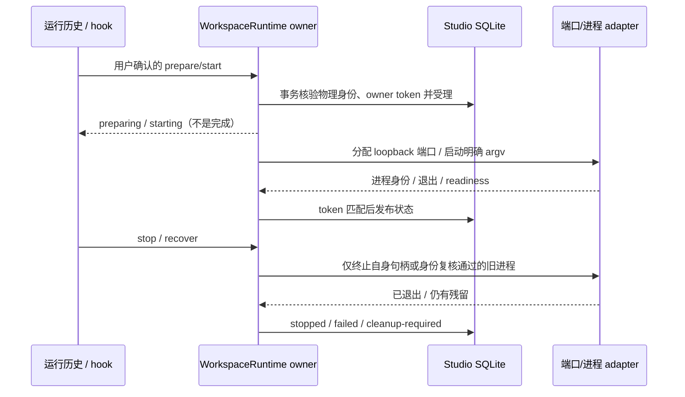

<!-- SPDX-License-Identifier: Apache-2.0 -->

# 工作区运行环境生命周期

2026-10-07。扩展现有 Studio Runtime；不另建工作区框架，不改变聊天源目录、群聊/工作流快照选择、哈希复核及 journaled apply。集成线程负责合并、版本与发布；本功能不涉及移动端。

## 所有者与接口

`StudioWorkspaceRuntime` 应用层 owner 唯一持有准备/服务操作及取消源。SQLite `workspace-runtime` 行是跨窗口的生命周期事实，键用 JSON 编码物理工作区 run/step 身份及路径，群聊历史共享同一成员目录时也共享运行环境。业务 run/step 仅用于查找已有 `StoredWorkspace`，不允许客户端提交 cwd。路径使用现有项目标准化函数；远端目录拒绝在本地执行。

现有服务增加一个 `workspaceRuntime({runId, stepId, control?})` 端点：省略 control 查询；control 包含 `prepare`、`start`、`stop`、`recover`。执行端口只在 Node 组合根注入；domain 验证命令及状态，adapter 负责 socket、进程与已验证的进程树清理。UI hook 通过服务读取状态，运行历史内提供紧凑展开面板，不保存第二份服务端事实。

## 授权、准备与边界

- 不读取或执行 AGENTS、package 脚本、仓库钩子或信任文件中的指令。准备命令与服务命令均由用户输入明确 executable + argv，并在显示实际 cwd/argv 后明确确认一次；请求必须包含 `approved: true`。只读内核/节点/运行授权拒绝执行；ask/full-access 仍要求这一明确确认，不授予后续 Agent 更宽权限。
- prepare 无命令表示用户明确选择不需要依赖安装；有命令时等退出码 0 并完成树清理才成为 prepared。prepare 失败不能启动；不自动重试，不把依赖从源目录拷贝进快照。
- start 要求准备完成。命令不经 shell，若用户需要 shell 必须明确输入 shell 可执行文件及其 argv。不持久化命令、环境或 stdout/stderr；错误只记录有界错误类别和退出码。
- 继承现有宿主进程环境但移除 Node/Electron 注入字段；只增加本次 HOST=127.0.0.1、PORT 与 KNORVIA_WORKSPACE_PORT。`{host}`/`{port}` argv 占位符由分配值展开。服务应使用这些值绑定 loopback；本功能不修改网络、防火墙或全局配置。
- 操作只针对已有工作区，不生成 Git worktree，不改源文件，不删项目/快照/依赖目录。已知凭据文件从新快照排除，旧快照的凭据也不进入变更发布；保留源文件原样。
- 同一物理工作区已有准备/服务操作、其他窗口仍持有 owner 或 apply 锁时拒绝再次启动。同一项目 Agent 仍在运行时拒绝 prepare/start；stop/recover 始终允许针对自己的 runtime 清理。

## 端口、状态与恢复

端口由 OS 在 127.0.0.1 上选择，首次保留 socket 与数据库端口声明协调并发；进程启动前释放 socket。无法消除释放 socket 与服务监听间的外部抢占窗口，若冲突或 readiness 失败必须失败并清理自身进程，不杀监听者。HTTP readiness 使用相对路径、无重定向和有界等待，只有进程仍活且响应 2xx/3xx 才发布 preview 地址。ready 后持续复核健康，退出或失去 readiness 撤销预览，保留真实失败原因。

状态为 idle → preparing → prepared → starting → ready；取消进入 stopping，完成树清理后 stopped。准备/启动/健康失败进入 failed；清理失败进入 cleanup-required，保留进程身份与端口声明以供重试，绝不显示 stopped。旧 owner 消失时投影 interrupted、撤销预览，明确要求 recover；不自动重新运行命令。recover 仅使用持久化的 PID + 起始时间 + PGID 复核身份，PID 复用或不确定的进程不得被终止；没有身份但 PID 仍活时保留 cleanup-required。

新 owner 每次受理生成 token，异步结果必须匹配 token 才能写回。其他 Host PID 仍活/不确定时不夺权。服务关闭先拒绝新操作并取消 runtime，再等待操作/清理排空，最后关闭 SQLite。正常退出已拥有进程树；意外退出期间新产生但未观测的后代可能需用户检查，不能宣称清理未知进程。

## 验收

- 非 Git + dirty source → setup/服务只在已有工作目录运行，源文件保留；apply 继续拒绝源文件冲突；已知凭据不复制或发布。
- 并发两个工作区 → 不同端口、不同状态行、各自 preview 和 stop；无关监听与进程继续存活。
- 准备非零退出、取消准备、找不到 executable、监听抢占、readiness 超时 → 可见正确错误与终态，失败准备不能启动。
- 第二窗口重复启动拒绝；重启后呈 interrupted，显式 recover 只清理匹配身份的进程；PID 复用与清理失败保留不确定状态。
- UI 场景：显示 cwd，输入/确认明确命令，观察准备与 ready/address，停止后地址撤销，失败与 recover 真实可见。中英文、现有黑白组件和桌面布局沿用现有设计。
- 执行根 fmt/provenance/lint/typecheck、相关架构与离线测试；单独记录交互验证及平台未执行项。
